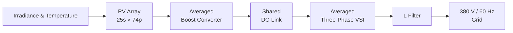
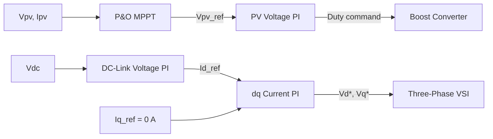

# Approximately 1 MW Grid-Connected PV System Modeling and Control

A MATLAB/Simulink engineering project that progressively models and integrates a grid-connected photovoltaic power system—from PV array characteristics and MPPT to Boost Converter dynamics, DC-link coupling, and grid-side dq control.

**MATLAB · Simulink · Simscape · Simscape Electrical**

**~1.006 MW PV Array · P&O MPPT · Boost Converter · Shared DC-Link · Three-Phase VSI · dq Current Control · 380 V / 60 Hz Grid**

> **Current milestone:** STEP 6 implementation complete. MATLAB runtime validation and quantitative result verification are pending.

## Overview

The repository develops a grid-connected PV model in six reproducible stages: a script-driven dynamic-system workflow, simplified PV source, P&O MPPT, averaged Boost stage, averaged grid inverter, and physically coupled PV-to-grid model. The array uses 25 modules per string and 74 parallel strings: 1,850 example modules rated at 1,005,752.5 W nominal (approximately 1.006 MW).

This is an engineering and learning platform. Its example PV parameters are not a manufacturer-specific accuracy claim, and implementation completion is not runtime validation.

## System Architecture

### Power Flow



### Control Architecture



Detailed equations, signal conventions, and boundaries are in [System Architecture](docs/architecture.md).

## Key Engineering Features

| Area | Current implementation |
| --- | --- |
| PV Modeling | Simplified single-diode source with irradiance and temperature inputs |
| Array Sizing | 25 series × 74 parallel = 1,850 modules; approximately 1.006 MW nominal |
| MPPT | P&O using `Vpv`, `Ipv`, `ΔP`, and `ΔV` |
| DC/DC Conversion | Lossless averaged Boost model with `Vpv`, `iL`, and `Vdc` states |
| PV-Side Control | `Vpv - Vpv_ref` PI, bounded duty, conditional anti-windup |
| DC-Link | One capacitor state couples PV delivery and inverter extraction in STEP 6 |
| DC/AC Conversion | Averaged three-phase VSI with voltage-vector limiting |
| Grid-Side Control | DC-link voltage PI and dq current PI with feedforward and decoupling |
| Reactive Current Target | `Iq_ref = 0 A` |
| Grid Interface | Balanced 380 V line-line RMS, 60 Hz grid through an L filter |
| System Integration | STEP 2–5 logic coupled through DC-link energy balance |

## Development & Validation Status

| Stage | Scope | Implementation | Runtime validation |
| --- | --- | :---: | :---: |
| STEP 0 | Repository and environment setup | ✅ | Not applicable |
| STEP 1 | MATLAB/Simulink dynamic-system workflow | ✅ | ⏳ Pending |
| STEP 2 | PV module/array modeling and sizing | ✅ | ⏳ Pending |
| STEP 3 | P&O MPPT | ✅ | ⏳ Pending |
| STEP 4 | Averaged Boost Converter and DC-link | ✅ | ⏳ Pending |
| STEP 5 | Averaged grid-side inverter and dq control | ✅ | ⏳ Pending |
| STEP 6 | Integrated approximately 1 MW PV-grid system | ✅ | ⏳ Pending |
| NEXT | Runtime validation and transient analysis | — | Planned |

## Integrated System

STEP 6 is subsystem coupling, not script concatenation. It removes the STEP 4 temporary DC load and STEP 5 independent DC source, then makes PV-side delivery and grid-side extraction act on one DC-link state:

```text
PV-side delivery
        ↓
   Shared DC-Link
        ↓
Grid-side extraction
```

The central relationship is `Cdc · dVdc/dt = (1-D)iL - Pinverter/Vdc`. Because the controllers interact through stored DC-link energy, isolated subsystem behavior cannot establish integrated behavior. See [STEP 6](docs/steps/step06_integrated_system.md).

## Results

Runtime validation is pending. No plots or numerical performance claims are presented as validated results. Future evidence should cover PV I-V/P-V characteristics, array sizing, MPPT response, PV-voltage tracking, Boost inductor and duty behavior, DC-link voltage, dq current tracking, irradiance transients, and PV-to-grid power flow. Acceptance criteria must be defined before interpreting those results.

## Engineering Decisions

**Why develop the system in stages?** Subsystem isolation narrows fault location and makes assumptions easier to inspect.

**Why use averaged converter models first?** Averaging removes switching-scale complexity while the energy-flow architecture and cascaded controllers are established.

**Why use a shared DC-link in STEP 6?** It removes artificial test boundaries and forces the Boost and inverter stages to exchange energy through the same physical state.

## Quick Start

### Requirements

The reference environment is MATLAB/Simulink R2025a, with R2024b compatibility retained where practical: MATLAB, Simulink, Simscape, and Simscape Electrical.

### Project Setup

```matlab
run("scripts/check_environment.m")
run("scripts/setup_project.m")
```

### Run Individual Steps

```matlab
run("models/step01_basics/run_step01.m")
run("models/step02_pv_array/run_step02.m")
run("models/step03_mppt/run_step03.m")
run("models/step04_boost_converter/run_step04.m")
run("models/step05_grid_inverter/run_step05.m")
run("models/step06_integrated_system/run_step06.m")
```

## Technical Documentation

Start with the [technical documentation navigator](docs/README.md).

### System-Level Documentation

- [System Architecture](docs/architecture.md)
- [Validation Strategy](docs/validation_strategy.md)

### Step-by-Step Documentation

- [STEP 1 — Modeling Workflow](docs/steps/step01_basics.md)
- [STEP 2 — PV Array](docs/steps/step02_pv_array.md)
- [STEP 3 — P&O MPPT](docs/steps/step03_mppt.md)
- [STEP 4 — Boost Converter and DC-Link](docs/steps/step04_boost_dc_link.md)
- [STEP 5 — Grid Inverter and dq Control](docs/steps/step05_grid_inverter.md)
- [STEP 6 — Integrated System](docs/steps/step06_integrated_system.md)

## Known Limitations

| Boundary | Current state |
| --- | --- |
| MATLAB runtime validation | Pending |
| Grid synchronization | Ideal electrical angle |
| PLL | Not implemented |
| Boost Converter / three-phase VSI | Averaged |
| Switching-level PWM / detailed semiconductors | Not implemented |
| AC interface | L filter |
| Transformer | Not yet integrated |
| Detailed conversion losses | Not yet modeled |
| Full transient analysis | Planned |

## Repository Structure

```text
analysis/      Result-plotting and transient-analysis utilities
docs/          System and step-level technical documentation
models/        STEP 1–6 models, parameters, controllers, and runners
references/    Source-policy notes; external originals are not stored
results/       Generated result destination
scripts/       Environment check and project setup
tests/         Equation, control, power, and integration checks
```

## Roadmap

1. Execute STEP 1–6 in the reference MATLAB environment.
2. Define quantitative acceptance thresholds before evaluating outputs.
3. Validate subsystems, then repeat validation after integrated coupling.
4. Analyze irradiance transients and energy consistency.
5. Consider switching-level PWM, PLL, transformer, and loss models as later scope.

## Source-Material Policy

Professor-provided PDFs, course material, assignment originals, and personal email are not stored here. The repository contains original work and directly generated results; see [references/README.md](references/README.md).

## License

A license file will be added after code and third-party material are reviewed for public portfolio release.
