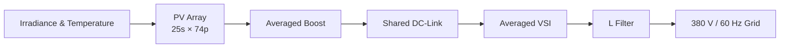
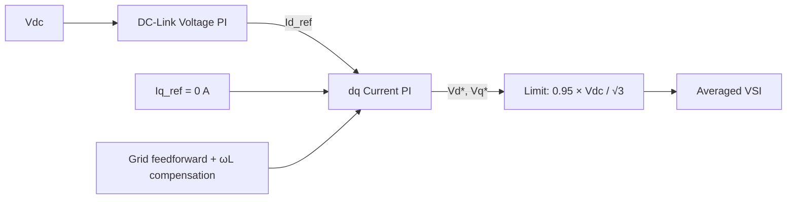
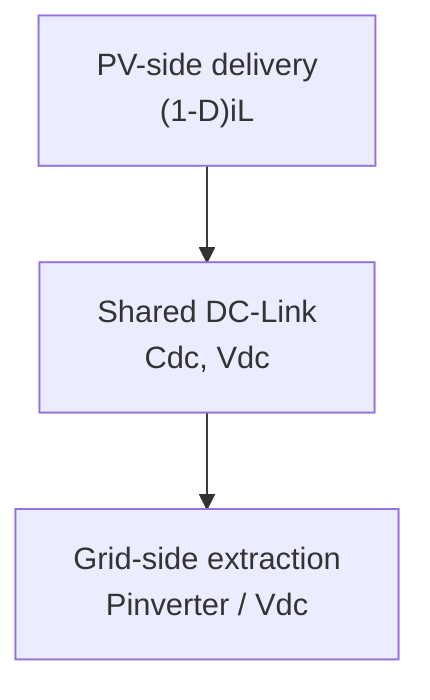

# System Architecture

## 1. System Objective

The project models an approximately 1 MW grid-connected PV chain and its cascaded controls. The current goal is an inspectable averaged model in which PV operating-point control and grid extraction interact through a shared DC-link. Runtime evidence remains pending.

## 2. Current System Boundary

STEP 6 contains a simplified PV array, averaged Boost Converter, shared DC-link capacitor, averaged three-phase VSI, L filter, and balanced 380 V line-line RMS / 60 Hz grid. The angle is ideal. PLL, switching PWM, detailed semiconductors, transformer, and detailed losses are outside the boundary.

The array is `25s × 74p`: 1,850 example 543.65 W modules, totaling 1,005,752.5 W nominal (approximately 1.006 MW).

## 3. Power Flow



MPPT is a controller, not a physical power-flow element.

## 4. PV-Side Control Architecture


The control error is `eV = Vpv - Vpv_ref`. Increasing duty tends to increase inductor current and pull PV voltage down. Duty is constrained to `0.05 ≤ D ≤ 0.90`; conditional integration allows updates when unsaturated or when the error unwinds saturation.

## 5. Boost Converter Model

The lossless averaged states are `Vpv`, `iL`, and `Vdc`:

```text
diL/dt  = (Vpv - (1-D)Vdc) / L
dVdc/dt = ((1-D)iL - Iload) / Cdc
dVpv/dt = (Ipv - iL) / Cpv
```

The middle equation is the isolated STEP 4 boundary. STEP 6 replaces `Iload` with inverter extraction. Averaging omits PWM and switching ripple.

## 6. Grid-Side Control Architecture



The ideal `θ = 2πft` aligns grid voltage with the d-axis; no PLL is present. The outer error is `Vdc - Vdc_ref`, so excess voltage requests greater positive `Id_ref`. The inner loop includes grid-voltage feedforward, resistance terms, and cross-coupling compensation. `Iq_ref = 0 A` is a target, not achieved-performance evidence.

## 7. Shared DC-Link Integration

```text
Cdc · dVdc/dt = (1-D)iL - Pinverter/Vdc
```



The capacitor absorbs instantaneous mismatch. PV, inverter DC, and grid power may differ during transients as stored energy changes.

## 8. Development Architecture

```text
STEP 4: Boost → DC-Link → temporary equivalent load
STEP 5: independent DC-side boundary → DC-Link → inverter
STEP 6: Boost → shared DC-Link → inverter
```

The STEP 4 resistance and STEP 5 prescribed DC input are test boundaries. STEP 6 removes both and reuses prior functions around one coupled state model.

## 9. Current Modeling Assumptions

| Topic | Boundary |
| --- | --- |
| PV source | Engineering example, not manufacturer-fitted |
| Boost / VSI | Lossless averaged models |
| Grid | Balanced 380 V line-line RMS, 60 Hz |
| Synchronization | Ideal angle; no PLL |
| AC interface | L filter |
| PWM, detailed semiconductors | Not implemented |
| Transformer | Not integrated |
| Detailed losses | Not modeled |
| Runtime and quantitative validation | Pending |

## 10. Related Documentation

- [Documentation Navigator](README.md)
- [Validation Strategy](validation_strategy.md)
- [STEP 4](steps/step04_boost_dc_link.md)
- [STEP 5](steps/step05_grid_inverter.md)
- [STEP 6](steps/step06_integrated_system.md)
