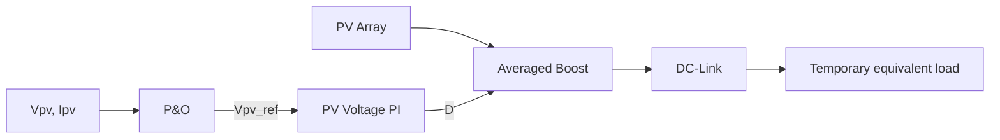

# STEP 4 — Averaged Boost Converter and DC-Link

## Objective

Introduce PV-side converter dynamics and translate `Vpv_ref` into a bounded Boost duty command while retaining an isolated output test boundary.

## Why This Step Exists

STEP 3 does not contain energy-storage dynamics. STEP 4 adds input capacitance, Boost inductance, DC-link capacitance, saturation, and anti-windup before grid-side coupling.

## Model Scope

The lossless averaged model has three states: PV input-capacitor voltage `Vpv`, inductor current `iL`, and DC-link voltage `Vdc`. A fixed equivalent resistance consumes DC output power. This **temporary load is a test boundary, not the final system load**.

## System / Control Structure



## Mathematical Model

```text
diL/dt  = (Vpv - (1-D)Vdc) / L
dVdc/dt = ((1-D)iL - Iload) / Cdc
dVpv/dt = (Ipv - iL) / Cpv
```

For the temporary resistor, `Iload = Vdc/Rload`. The resistance is derived from DC-link reference voltage and the minimum theoretical MPP power in the test sequence.

## Parameters

Representative implementation values include `L = 5 mH`, `Cpv = 20 mF`, `Cdc = 50 mF`, and `Vdc_ref = 1350 V`. Irradiance follows 600 → 1000 → 800 → 400 W/m² over four one-second intervals.

## PV Voltage Controller

The error is:

```text
eV = Vpv - Vpv_ref
```

Higher duty raises inductor current and tends to reduce PV voltage, so this sign is intentional. Feedforward uses the ideal Boost relationship, then PI correction is constrained to:

```text
0.05 ≤ D ≤ 0.90
```

Conditional integration updates when unsaturated or when the error would unwind upper/lower saturation; otherwise the integrator is held.

## Implementation / Engineering Flow

The runner loads STEP 2–4 parameters, builds reference PV curves, advances averaged states, applies MPPT updates and voltage control, calculates the temporary-load output, and prepares interval metrics and plots.

## Run

```matlab
run("scripts/setup_project.m")
run("models/step04_boost_converter/run_step04.m")
```

## Expected Outputs

Four figures and `results/step04/step04_summary.csv`, covering PV/reference voltage, PV power, inductor current, duty, DC-link voltage, and output power. These outputs are intended, not runtime-confirmed in this task.

## Validation Criteria

Check numerical integrity, state bounds, controller sign, duty limiting, anti-windup, `Vpv` tracking direction, inductor-current behavior, DC-link response, and power consistency at the temporary load. Declare metric tolerances before review.

## Current Status

Implemented. Runtime validation pending.

## Known Limitations

The averaged, lossless model omits PWM, ripple, semiconductor behavior, magnetics losses, and the real inverter load. An isolated result cannot establish STEP 6 behavior.

## Role in Later Steps / Transition

STEP 6 removes the temporary resistance and replaces its current with inverter DC-power extraction through the shared DC-link equation.

## Related Files

- `models/step04_boost_converter/step04_boost_parameters.m`
- `models/step04_boost_converter/pv_voltage_controller.m`
- `models/step04_boost_converter/simulate_boost_converter.m`
- `models/step04_boost_converter/run_step04.m`
- [System Architecture](../architecture.md)
