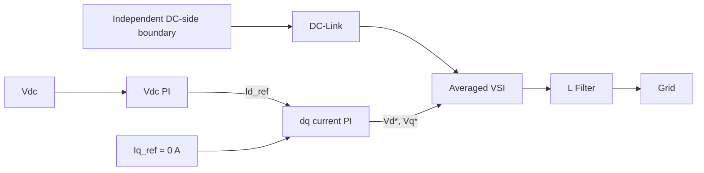

# STEP 5 — Averaged Grid-Side Inverter and dq Control

## Objective

Develop the grid-side DC-link voltage and dq current-control architecture against an independent DC-side test boundary.

## Why This Step Exists

Separating the inverter from Boost dynamics allows transforms, control signs, limits, and grid power calculation to be inspected before full coupling.

## Model Scope

The model uses a balanced 380 V line-line RMS, 60 Hz grid, averaged VSI, and L filter. Its electrical angle is ideal (`θ = 2πft`); no PLL is implemented or evaluated. Prescribed DC input-power levels and the DC-link capacitor form an **independent DC-side test boundary**.

## System / Control Structure



The outer error is `Vdc - Vdc_ref`; high DC voltage requests more positive d-axis current and active-power export. The inner loop applies PI feedback, grid-voltage feedforward, filter-resistance terms, and `ωL` cross-coupling compensation.

## Mathematical Model

With grid voltage aligned to the d-axis, the implemented averaged filter dynamics and controller are expressed in dq coordinates. The voltage command is scaled when its magnitude exceeds:

```text
0.95 × Vdc / sqrt(3)
```

The integrators are conditionally held when saturation would be driven further. Three-phase active/reactive power is calculated from dq voltage and current.

## Parameters

Key values are `Vdc_ref = 1350 V`, `Lfilter = 0.30 mH`, `Rfilter = 0.020 Ω`, and `Iq_ref = 0 A`. The prescribed input-power sequence is 500 kW, 800 kW, then 500 kW over the one-second simulation.

## Implementation / Engineering Flow

The runner loads parameters, simulates the independent DC source and averaged inverter/filter, transforms dq/abc signals, evaluates power, then prepares plots and interval summaries.

## Run

```matlab
run("scripts/setup_project.m")
run("models/step05_grid_inverter/run_step05.m")
```

## Expected Outputs

Five figures and `results/step05/step05_summary.csv` covering DC-link voltage, dq references/currents, voltage commands or modulation, three-phase signals, and active/reactive power. Runtime confirmation is pending.

## Validation Criteria

Check transform convention, ideal-angle alignment, outer-loop sign, current-loop direction, feedforward/decoupling terms, command limiting, saturation handling, and power calculation. `Iq_ref = 0 A` does not itself prove reactive-current tracking. Define tolerances before evaluation.

## Current Status

Implemented. Runtime validation pending.

## Known Limitations

No PLL, PWM, switching ripple, detailed devices, transformer, or Boost dynamics are included. Grid synchronization has not been evaluated.

## Role in Later Steps / Transition

STEP 6 removes the independent DC source and makes inverter demand discharge the same capacitor charged by the Boost stage.

## Related Files

- `models/step05_grid_inverter/step05_inverter_parameters.m`
- `models/step05_grid_inverter/dc_link_voltage_controller.m`
- `models/step05_grid_inverter/dq_current_controller.m`
- `models/step05_grid_inverter/simulate_grid_inverter.m`
- `models/step05_grid_inverter/run_step05.m`
- [System Architecture](../architecture.md)
