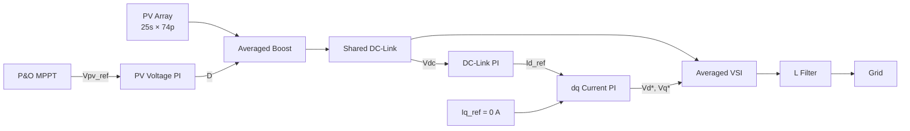

# STEP 6 — Integrated Approximately 1 MW PV-Grid System

## Objective

Couple the PV/Boost and grid-inverter subsystems through one shared DC-link state. **Physical coupling replaces artificial subsystem boundaries.**

## Why This Step Exists

Isolated stages prescribe what lies across their boundaries. Integration makes DC-link voltage emerge from the mismatch between Boost delivery and inverter extraction, exposing controller interactions and stored-energy dynamics that isolated checks cannot establish.

## Model Scope

The model reuses STEP 2–5 PV, sizing, MPPT, control, transform, and power functions. It represents a `25s × 74p` array (1,850 modules, approximately 1.006 MW), averaged Boost, shared DC capacitor, averaged VSI, L filter, and balanced 380 V / 60 Hz grid with ideal angle.

## Boundary Changes

| Isolated boundary | STEP 6 treatment |
| --- | --- |
| STEP 4 temporary DC load | Removed |
| STEP 5 independent DC source | Removed |
| Separate DC-side abstractions | Replaced by one shared DC-link |

```text
PV-side delivery
        ↓
   Shared DC-Link
        ↓
Grid-side extraction
```

## System / Control Structure



## Mathematical Model

The principal coupling equation is:

```text
Cdc · dVdc/dt = (1-D)iL - Pinverter/Vdc
```

Boost output current charges the capacitor and averaged inverter DC power discharges it. The implementation also advances `Vpv`, `iL`, `Id`, and `Iq`. During transients, stored energy in `Cpv`, the Boost inductor, `Cdc`, and the L filter allows instantaneous PV, inverter, and grid powers to differ.

## Parameters

The four-second input sequence is 600, 1000, 800, and 400 W/m² in consecutive one-second intervals at 25 °C. The sample time follows STEP 5; the MPPT update period and duty limits follow STEP 4. STEP 6 uses the STEP 5 DC-link capacitance and 1350 V reference.

## Implementation / Engineering Flow

The runner loads prior parameters and functions, calculates integrated initial conditions, advances all coupled states, periodically checks state bounds, calculates summaries over the final 20% of each irradiance interval, and prepares plots/CSV output. Reuse avoids maintaining divergent copies of subsystem logic.

## Run

```matlab
run("scripts/setup_project.m")
run("models/step06_integrated_system/run_step06.m")
```

## Expected Outputs

Eight plots and `results/step06/step06_system_summary.csv` are intended to cover PV/MPPT behavior, Boost duty/current, DC-link behavior, dq tracking, three-phase waveforms, and power flow. No output is claimed as runtime-confirmed here.

## Validation Criteria

Future validation should proceed in layers:

1. **Numerical integrity** — finite states, valid bounds, intended completion, and artifacts.
2. **PV-side behavior** — I-V operating point, MPPT decisions, voltage tracking, duty, and inductor current.
3. **DC-link behavior** — voltage, current mismatch, saturation interaction, and stored-energy response.
4. **Grid-side behavior** — dq references/tracking, command limit, three-phase signals, and active/reactive power.
5. **Integration consistency** — energy and power relationships across the removed boundaries during steady intervals and transients.

Thresholds must be declared before interpreting observations as successful. Passing STEP 4 and STEP 5 separately cannot validate STEP 6 because coupling changes the dynamics and controller interactions.

## Current Status

Implemented. Runtime validation and quantitative result verification pending.

## Known Limitations

The system uses ideal grid angle and averaged, lossless converter models. PLL, switching PWM, detailed semiconductors, transformer, losses, and full transient analysis are not included. A computed PV-to-grid power ratio must not be interpreted as physical conversion efficiency under these assumptions.

## Role in Later Steps / Transition

STEP 6 is the present implementation milestone. The next work is runtime and integrated validation, not automatic addition of more plant detail.

## Related Files

- `models/step06_integrated_system/step06_system_parameters.m`
- `models/step06_integrated_system/calculate_integrated_initial_conditions.m`
- `models/step06_integrated_system/simulate_integrated_pv_grid_system.m`
- `models/step06_integrated_system/validate_integrated_states.m`
- `models/step06_integrated_system/run_step06.m`
- [System Architecture](../architecture.md)
- [Validation Strategy](../validation_strategy.md)
